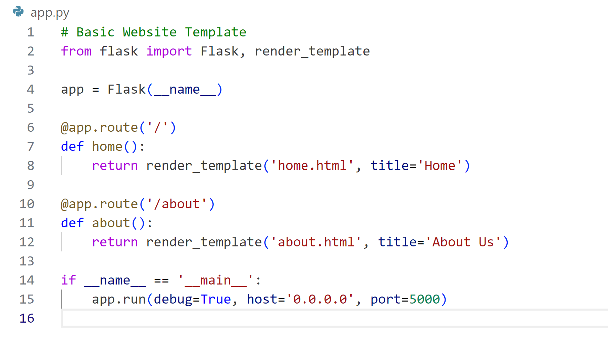
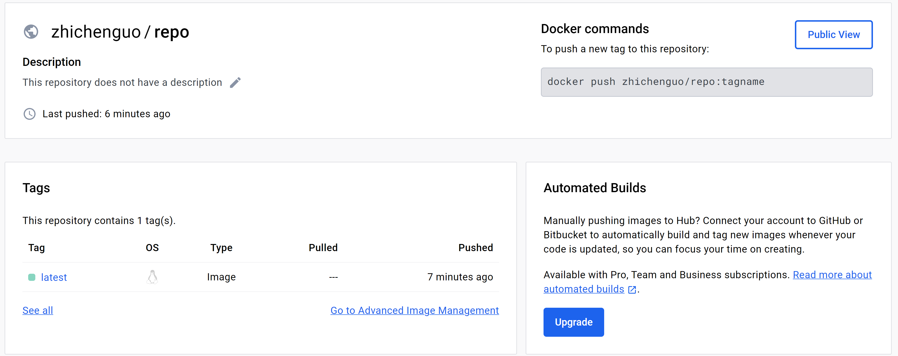
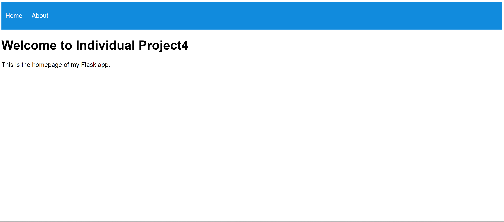
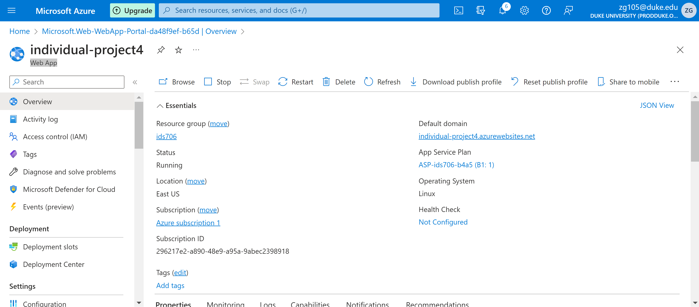

# Individual-project-zg105
This readme will walk you through creating an auto scaling app using GitHub, Docker, and Microsoft App Services 

## video link
https://youtu.be/5g7VKcxG7nw

## Steps
1. Set up your environment using GitHub Code Spaces and VScode. Start with a small web interface with html and css

2. Build a basic flask app (critical to have host and port number). I built it in app.py

3. Build Docker File 
Commands:
  - docker build app-name .
  - docker run -p  5000:5000 app-name

4. Login into docker hub
docker login --username=zhichenguo in the terminal, build container and push it to DockerHub
Commands:
  - docker login --username=zhichenguo
  - docker build -t zhichenguo/repo .
  - docker push zhichenguo/repo

5. Set up via Azure App Services, add "WEBSITES_PORT" with a value of 5000, add a docker hub resource

6. After deployment you'll need to go configuration and add "WEBSITES_PORT" with a value of 5000. This will allow your app to run on at the public URL provided by Azure

## Result
Website Port 

Public URL

