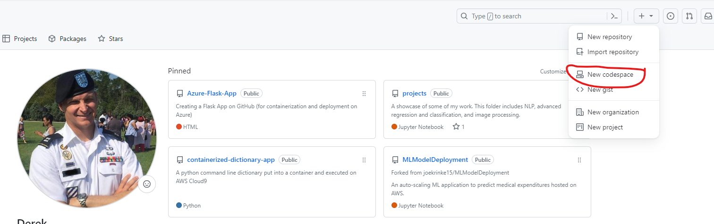
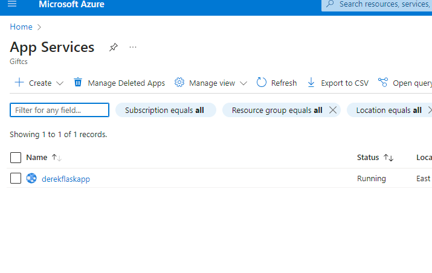
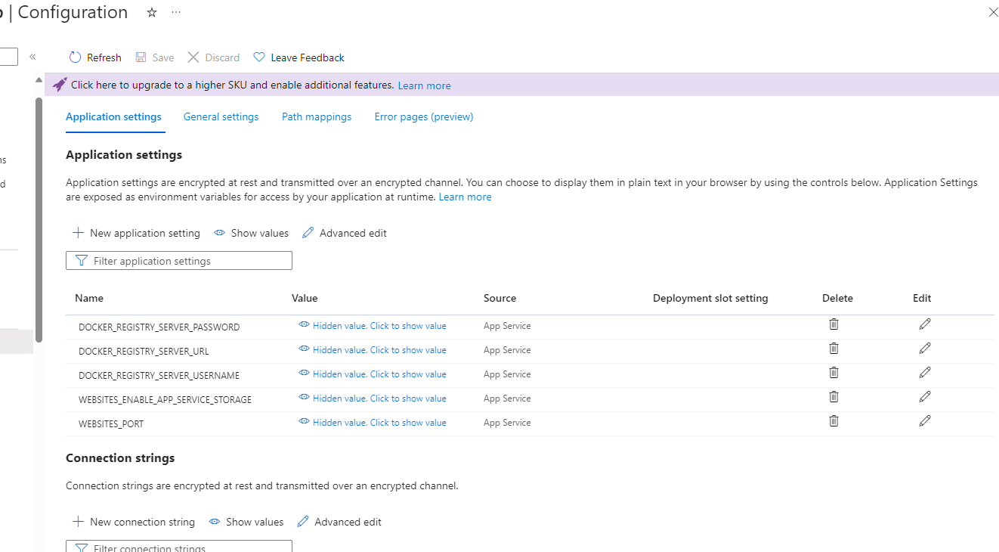

# Azure-Flask-App
This readme will walk you through creating an auto scaling app using GitHub, Docker, and Microsoft App Services 

## Step One Environment Set Up
Set up your environment using GitHub Code Spaces and VScode.

## Step Two Flask App
Build a basic flask app (critical to have host and port number). Feel free to start with mine but there are also plenty of more sophisticated ones online, the most important thing to me was getting the plumbing sorted.

## Step Three Build Docker File 
Use mine as a template but there are a couple of gotchas. Be sure to expose the port 5000 
Commands:
  - docker build app-name .
  - docker run -p  5000:5000 app-name

## Step Four Login to DockerHub via Codespaces
docker login --username=XXXX in the terminal, build your container and push it to DockerHub (you will have to make your repo on DockerHub first)
Commands:
  - docker login --username=
  - docker build -t username/repo .
  - docker push username/repo

Create the repo with the title you need prior to pushing

## Step Five 
Set up via Azure App Services, it's key in the configuration setting to add "WEBSITES_PORT" with a value of 5000 (more below)

### Step Five a) 
Log into Azure, search app services and select create (web app)

### Step Five b) 
When creating the app be sure to select Docker Container (BTW their are some gotchas with the naming so read the instructions)

### Step Five c) 
When selecting the Docker container be sure to point to the correct image tab.

### Step Five d) 
After deployment you'll need to go configuration and add "WEBSITES_PORT" with a value of 5000 (more below). This will allow your app to run on at the public URL provided by Azure

Website Port 

Public URL
